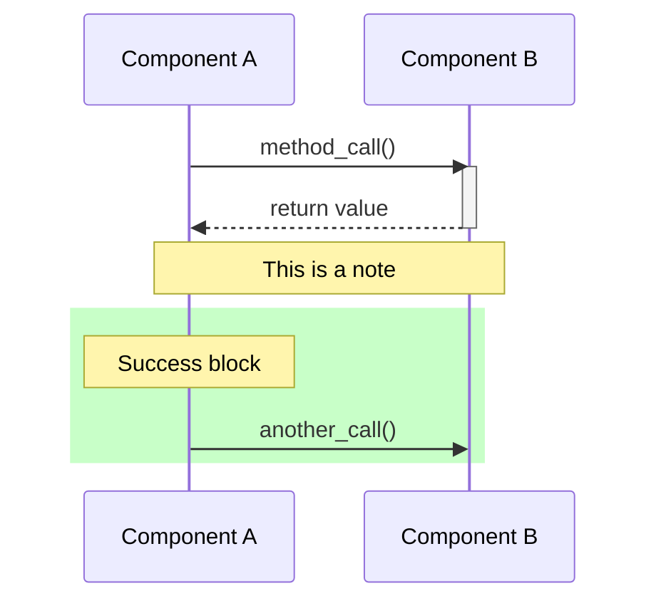

# Billing Flow Diagrams

This directory contains Mermaid sequence diagrams documenting the billing process.

## Diagrams

1. **`billing-flow-happy-path.mmd`** - Normal successful billing flow
2. **`billing-flow-rate-limit.mmd`** - Rate limit error handling with immediate retry
3. **`billing-flow-payment-error.mmd`** - Payment error handling (card declined)

## Viewing Diagrams

### Option 1: GitHub/GitLab (Easiest)

GitHub and GitLab render `.mmd` files automatically. Just view the files in your browser:
- Click on `billing-flow-happy-path.mmd` in GitHub
- The diagram renders automatically

### Option 2: VS Code (Best for Editing)

Install the **Mermaid Preview** extension:

```bash
# Install VS Code extension
code --install-extension bierner.markdown-mermaid
```

Then:
1. Open any `.mmd` file in VS Code
2. Right-click → "Open Preview"
3. Or use `Ctrl+Shift+V` to preview

### Option 3: Command Line (Linux)

Install Mermaid CLI:

```bash
# Using npm (if you have Node.js installed)
npm install -g @mermaid-js/mermaid-cli

# Or using yarn
yarn global add @mermaid-js/mermaid-cli
```

Render to PNG/SVG:

```bash
# Generate PNG
mmdc -i billing-flow-happy-path.mmd -o billing-flow-happy-path.png

# Generate SVG (better for zoom/print)
mmdc -i billing-flow-happy-path.mmd -o billing-flow-happy-path.svg

# Generate all diagrams
for file in billing-flow-*.mmd; do
  mmdc -i "$file" -o "${file%.mmd}.png"
done
```

### Option 4: Online Editor (No Installation)

Use the official Mermaid Live Editor:
- https://mermaid.live/

1. Copy the contents of any `.mmd` file
2. Paste into the editor
3. View/export the diagram

### Option 5: IntelliJ/RubyMine

Install the **Mermaid** plugin:
1. Go to Settings → Plugins
2. Search for "Mermaid"
3. Install and restart
4. Open `.mmd` files to see live preview

## Diagram Syntax

Mermaid uses a simple text-based syntax:



### Key Elements Used

- `participant X as Name` - Define components/actors
- `A->>B: message` - Solid arrow (synchronous call)
- `B-->>A: message` - Dashed arrow (return/response)
- `activate/deactivate` - Show when component is active
- `Note over A,B: text` - Add notes/comments
- `rect rgb(r,g,b)` - Colored background blocks
- `loop`, `alt`, `opt` - Control structures

## Editing Tips

1. **Keep it readable** - Don't make diagrams too complex
2. **Use colors** - `rect rgb(...)` to highlight different scenarios:
   - Green (200, 255, 200) - Success paths
   - Red (255, 200, 200) - Error paths
   - Yellow (255, 255, 200) - Important notes
   - Blue (200, 200, 255) - Future/delayed actions
3. **Add notes** - Explain WHY things happen, not just WHAT
4. **Break into multiple diagrams** - One scenario per diagram

## Comparing Rate Limit vs. Payment Error

| Aspect | Rate Limit Error | Payment Error |
|--------|------------------|---------------|
| **Exception** | `Finance::Payment::RateLimitError` | `Finance::Payment::CreditCardPurchaseFailed` |
| **HTTP Code** | 429 | 402 |
| **Caught where?** | NOT caught in Invoice#charge! | Caught in Invoice#charge! |
| **Invoice state** | Remains "pending" | Changed to "unpaid" |
| **Retry counter** | NOT incremented | Incremented (1/3, 2/3, 3/3) |
| **Job behavior** | Fails → Sidekiq retry | Completes successfully |
| **Retry timing** | ~15s, ~45s, ~135s... | 3 days later |
| **Lock** | Released immediately | Held for 1 hour |
| **User notification** | None | Email sent immediately |
| **Re-raised?** | Yes (bubbles to BillingWorker) | No (handled in Invoice) |

## Key Implementation Details

### Critical Fixes

1. **`bill_and_charge_each` (billing_strategy.rb:378-383)**
   - Separate rescue for `RateLimitError` to prevent swallowing
   - Must re-raise immediately

2. **`BillingStrategy.daily` (billing_strategy.rb:92-112)**
   - Separate rescue for better logging (WARN vs ERROR)
   - Don't call `results.failure()` for rate limits

3. **`BillingService.call!` (billing_service.rb:29-41)**
   - Release lock on rate limit
   - Re-raise error for Sidekiq

4. **`BillingWorker` (billing_worker.rb:8-20)**
   - Exponential backoff for rate limits: `(3 ** count) * 5 + jitter`
   - Standard delay for other errors: `1.hour + 10`

## See Also

- `STRIPE_RATE_LIMIT_HANDLING.md` - Detailed implementation documentation
- `test/integration/finance/stripe_rate_limit_handling_test.rb` - Comprehensive tests
